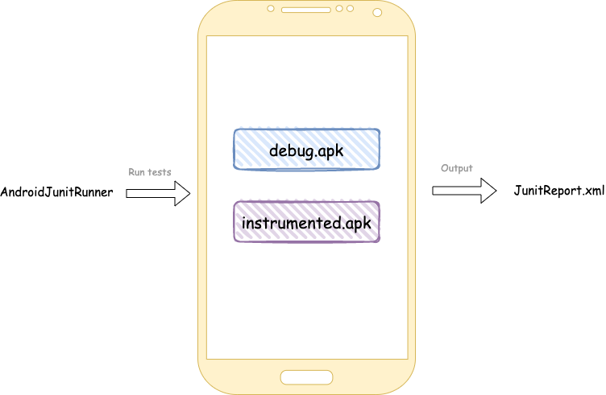

# Instrumented testing

Instrumented tests are usual junit tests, but with one peculiarity:
<br>
They can be launched on Android device only.

Using them, you may check how your application communicates with Android OS.

However, they are written and executed much slower.

## 1. Tests location

Unlike regular jvm tests, instrumented tests located in different src: `androidTest`
<br>

##### Why different src?

You need to write code which describes a communication between your application and android device. For instance,
clicking some buttons and checking that particular content has been shown, etc.

All that code should be compiled, somehow installed on the device and should make yours application to trigger the
checks you need.

This code can't be a part of `testSrc`, because of that case we run it on `JVM`. There is no information about
everything related to android.
<br>
Every `Android SDK` class instance used in `JVM` test will be stubbed.

In `androidSrc` we have a real knowledge about `Android SDK`
<br>

## 2. How tests run under the hood


To be able to run your tests on `CI` and make it a part of `CD`, it's really important to understand how it works under
the hood.

##### 2.1 Build

To test our application, we need to build it. We can do that with gradle:

```bash
# It will build an apk file located in app/build/outputs/debug/debug.apk
./gradlew assembleDebug
```

However, it's not enough for us. Remember? We also need to take care of the code we write in `androidTestSrc`. It also
should be built and will be represented as an apk:

```bash
# It will build an apk file located in app/build/outputs/debug/debug.apk
./gradlew assembleDebug
# It will build an apk file located in app/build/outputs/androidTest/instrumented.apk
./gradlew assembleDebugAndroidTest
```

We've got 2 apks:
`Application` and `Test application`, which can communicate with `Application`

##### 2.2 Install

To do that, we need to use `adb`

```shell
adb install debug.apk
adb install instrumented.apk
```

##### 2.3 Run

For running instrumented tests, `AndroidJunitRunner` is responsible

As an input, you need to provide tests you want to run. As an output, `JunitReport.xml` will be provided

All you need to do it's to execute `adb` command:

```shell
adb shell am instrument -w -m -e debug false \
 -e class 'com.alexbykov.myapplication.ExampleInstrumentedTest#myTest' \
com.alexbykov.myapplication.test/androidx.test.runner.AndroidJUnitRunner
```

We need to provide some information about tests needed to be launched: particular class, class with method or package.

After execution, you may find junit report in `app/build/test-results/`



It's also possible to define your own instrumented arguments and get them in tests:

```kotlin
//add -e myKey "test" to adb command 
InstrumentationRegistry.getArguments().getString("myKey", "value")
```

## 3. Tests location

[Official documentation](https://developer.android.com/training/testing/junit-runner#using-android-test-orchestrator)

## 3. Instrumented testing types

* UI
* Screenshot
* Migration

They are not a replacement of each other, they are complement to each other