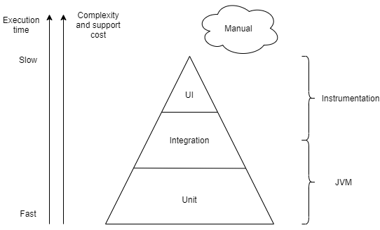

# Testing theory

This article will cover the most primitive things that will allow you to understand better the terms and general concepts regarding testing.
 It is also worth noting that there will be an accent on UI tests, because we are in CookBook for UI tests.

# Where it all starts
<i>Why do I need testing?</i> Users of your application/system/whatever should receive a quality product. 
 Thus, testing is about ensuring the quality of the product. Testing also includes creating a test plan, creating/conducting tests themselves and analyzing results of testing.

Let's focus on the topic of creating tests. To begin with, let's see the testing pyramid.

The width of each block is actually the ratio of the number of different types of tests to each other. 
For example, a lot of Unit tests is usually considered correct in the pyramid, but much less UI tests. 
  <b>This is due to two key parameters - stability and the cost of supporting each type of testing.</b>
 Unit tests have the highest stability, they are the fastest and they have the lowest cost of support, however, using Unit tests you won't be able to check the login flow of your application (which for example contains 5 screens).
  We will reveal each type of testing in more detail, for this we will go from the bottom up.

!!! Disclaimer

    <b>White-box testing</b> is a type of testing in which we have full access to the implementation and can interact with it. We know which output data will be with given input data.
     <b>Black-box testing</b> is a type of testing in which we don't have access to the implementation and cannot interact with it, however, we know which output data should be with given input data.
     <b>Gray-box testing</b> is a type of testing when you have partial access to the implementation (for example, not to all entities that being tested). At the same time, we know what output data will be with given input data.

## Unit tests
These are tests that check the operation of specific entities (for example, a repository class or a ViewModel) and are directly related to the implementation, which gives us the opportunity to test on the principle of a white box.
 They have high stability, because in order to break them, it is necessary to change the specific entity that they are testing.

## Integration tests
This type of tests is already a little less stable (than Unit tests), since we are going to test the interaction of 2 (or more) entities at once at the same time, but it still allows you to write in a White-box style. Now, having changed only one entity out of 2, there is a risk of failing integration tests.
 Integration tests are tests that checks how different components communicates with each other. That's why in that tests the most of the dependencies are not mocked and not even stubbed, they are real.
 It is by no means impossible to ignore these tests, since the Unit tests passed give us an understanding of what specific entities work, but how these entities work together we can only find out inside the application or using Integration testing.

!!! Info
    
    Examples of Integration tests in Android include database testing.
    Also UI tests are considered as integration, but with ability to check UI itself

## UI tests
The type of tests for which this whole CookBook was created. This is the most unstable type of tests (if we look at our pyramid of tests). 
 The slightest change in the layout of one screen (for example, a simple replacement of the `id` of the `View`) can easily lead to the fall of all your tests, while your application remains fully functional. 
 UI tests usually follow a black-box scenario when there is no concept of entities and their implementations.
 However, it is worth noting that testing on the native framework (Espresso) allows you to access classes inside your tests that turning the tests into a Gray-box testing style.
 Despite such low stability, the high cost of creating and maintaining them - it is this type of tests that brings us closer to how your users are going to use the application - <b>UI tests allow you to test User story</b>. This feature makes these tests incredibly important both for business and for an ordinary developer or tester. 
 If desired, they can be run at least for each new merge inside your CI, it will not take as long time as a complete manual regression.

## Manual tests
It is also worth noting that there is also manual testing outside of this testing pyramid. 
 It is difficult to talk about the stability of this type of testing (because there is already a human factor here), but a manual testing does not care that the `id` of the `View` has changed in the program. 
 It is also equally important that UI tests may miss some little things such as extra padding (unless you also check it inside the UI test), possibly a different toolbar background color, etc.
 Hence manual testing has an important role and cannot be completely replaced by conventional types of testing. 
 But don't forget that this is essentially a question of the acceptable quality of a particular product.

## Conclusion
* We got the basic concepts of testing, learned about the difference between Black/White/Gray-box testing.
* In this article we got knowledge of main types of testing and examined the areas of their application.
* UI tests are the most unstable, the longest and the most expensive in terms of support but they allow you to test entire User stories and can do it even on every merge.
