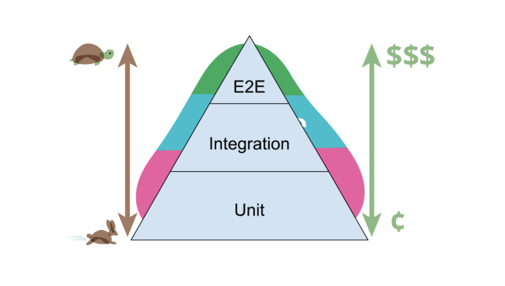

# Testing theory


This article will cover the most primitive things that will allow you to understand better the terms and general concepts regarding automated testing.
<br/>It is also worth noting that there will be an accent on UI tests, because we are in CookBook for UI tests.


## Where it all starts
<i>Why do I need testing?</i> Users of your application/system/whatever should receive a quality product. 
<br/>Thus, testing is about ensuring the quality of the product. Testing also includes creating a test plan, creating/conducting tests themselves and analyzing results of testing.

There are different means to classify tests. We will focus on the following

1. *Granularity*
2. *Running environment*
3. *Target*

## Classifying tests by granularity
To begin with, let's see the testing pyramid.


> Testing Pyramid (source Martin Fowler, triangle authorship Kent C. Dotts)

1. **End-to-End tests (E2E)**: these tests verify that all components in every single layer of the application work together as expected. They allow to test User stories - how our users are going to use the application. This makes them incredibly important both for business and for an ordinary developer or tester.
   However, this is the most unstable type of test, and the cost of creating and maintaining them is high. That's because there are a lot of factors we cannot control (e.g. network failures, clean user state before and after the test, etc.).
2. **Integration tests**: they focus on validating the interaction of 2 (or more) entities at once at the same time, but not the full system as with E2E tests. Most components involved are not mocks or stubs, but doubles or fakes.
3. **Unit tests**: they only cover the smallest testable unit, usually a function, or view.

The width of each block is actually the ratio of the number of different types of tests to each other. 
For example, a lot of Unit tests is usually considered correct in the pyramid, but much less E2E tests. 
<br/><br/><b>This is due to two key parameters - stability and the cost of supporting each type of testing.</b>
<br/>Unit tests have the highest stability, they are the fastest and they have the lowest cost of support. However, Unit tests do not intend to verify Use stories e.g. the login flow of your application (which for example contains 5 screens).
<br/><br/>

!!! Disclaimer

    Testing tools and frameworks can be classified regarding their access to the implementation details as follows:

    <b>White-box testing</b> is a type of testing in which we have full access to the implementation and can interact with it. We know which output data will be with given input data.
    <br/><b>Black-box testing</b> is a type of testing in which we don't have access to the implementation and cannot interact with it, however, we know which output data should be with given input data.
    <br/><b>Gray-box testing</b> is a type of testing when you have partial access to the implementation (for example, not to all entities that being tested). At the same time, we know what output data will be with given input data.

Apart from their granularity, there are two interesting means to classify tests, as pictured below


!!! Disclaimer

      Important to note that these classifications are not mutually exclusive. One can write, for instance

      1. Ui tests that run on the JVM and only test one view (i.e. unit test)
      2. Non-Ui tests that run on a device (i.e. instrumented) and test several components (i.e. integration test)

## Classifying tests by the environment where they can run on
Depending on the environment the tests can run on, we get the following distribution

1. **JVM (Java Virtual Machine) tests**: can run without the need of an emulator or physical device. These tests do not contain Android-specific code, although they might mock it under the hood.  

2. **Instrumentation tests**: those that require an emulator or physical device. These are tests that
   contain Android-specific code, like Views. Such code requires a DVM (Dalvik Virtual Machine) or Android Runtime (ART) since 5.0 to be executed, and therefore it cannot run on the JVM but on a device.

3. **Shared tests**: These are tests that are written once, but can run either as JVM or as Instrumentation tests. The principle is simple: *Write once, run everywhere*.
   These tests contain Android-specific code. Such code would need a device to run on. In order to enable that, when running on the JVM, that code is replaced by mocks under the hood. We'll go deeper into this later on.

## Classifying tests by their target
Depending on the target of our tests, they are split into the following categories

1. **UI tests**: focus on testing the WHAT (interaction/navigation); *WHAT is displayed* when interacting with the screen elements.
2. **Screenshot/Snapshot tests**:  focus on testing the HOW (visuals): *HOW a view is displayed* under a given state or configuration.
3. **Non-UI tests**: focus on testing non-ui related code like *BUSINESS LOGIC* or *DATABASE MIGRATIONS* among others

### Should I write Screenshot tests or Ui Tests?
It might be confusing to understand when to write Ui test rather than Screenshot tests and vice versa. They do not replace each other. Their focus is different as previously mentioned.
So let's imagine the following screen, which is a RecyclerView


A *Ui test would verify*, e.g. that after deleting a row in the recycler View, that row is not displayed anymore. It would test *WHAT is displayed after interacting with the view*

On the other hand, a *snapshot test would verify HOW that row is displayed* under numerous states and configurations: e.g. dark/light mode, LTR/RTL languages, different font sizes, wide/narrow screens...


> Up: Row when system font size set to huge </br>
  Down: Row in dark mode

You might think you could write a full screen snapshot test after deleting the row to verify it is not displayed anymore. Although it might work at the beginning, this approach comes with its own problems, the most relevant is that your **tests become brittle**.

Let me explain that with an example.
Imagine you change how the row is displayed. If you verify the snapshot test, it will fail. You need to record a new snapshot including those changes on the row. The issue here is that the focus of your test was to verify that the deleted row is not displayed anymore. What does it have to do with changing the appearance of the row? You guessed it. Nothing. But the test fails because of that.

Therefore, *every subtle change on the screen will require to record a new snapshot, although that change had nothing to do with the initial intention of the test*.
On the other hand, a Ui test would have not failed since we would be asserting whether the deleted row was displayed or not. No visuals involved.

To sum it up: **use both Ui test and Snapshot tests**, they complement each other. Think which is the right tool for the task at hand.

### Shared tests
Google made Espresso compatible with Robolectric through the `androidx.test` library.
This means, that we can write Espresso tests that will run on the JVM with Robolectric under the hood, if desired, as well as on a device or emulator.

#### How it works
First of all, in order to run shared tests either on the JVM or as instrumented, you need to create a `sharedTest` folder, and configure `sourceSets` in gradle accordingly.
```kotlin
sourceSets {
   ...
   //configure shared test folder
   val sharedTestFolder = "src/sharedTest/kotlin"
   val androidTest by getting {
       java.srcDirs("src/androidTest/java", sharedTestFolder )
   }
   val test by getting {
       java.srcDirs("src/test/java", sharedTestFolder )
   }
}
```

In order to write a shared test, it is important to use `androidx.test.ext.junit.runners.AndroidJunit4` by annotating them with ``@RunWith(AndroidJUnit4::class)``. Why? Take a look at the implementation of AndroidJunit4. The magic actually happens in this method

```kotlin
private static String getRunnerClassName() {
    String runnerClassName = System.getProperty("android.junit.runner", null);
    if (runnerClassName == null) {
      if (!System.getProperty("java.runtime.name").toLowerCase().contains("android")
          && hasClass("org.robolectric.RobolectricTestRunner")) {
        return "org.robolectric.RobolectricTestRunner";
      } else {
        return "androidx.test.internal.runner.junit4.AndroidJUnit4ClassRunner";
      }
    }
    return runnerClassName;
}
```
The `System.getProperty("android.junit.runner", null)` acts as a switch to detect the environment where the test is running and decide whether to use the `RobolectricTestRunner` or the `AndroidJUnit4ClassRunner` accordingly.

Once you have your test written in the sharedTestFolder, it is ready to run on any environment! 
In order to run it on the JVM, execute a command similar with the following structure

```
./gradlew :MODULE:testVARIANTUnitTest --tests "PACKAGE.CLASS"
```

and to run it on the device/emulator, the command would have this format
```
./gradlew :MODULE:connectedVARIANTAndroidTest -Pandroid.testInstrumentationRunnerArguments.class=PACKAGE.CLASS
```

#### Benefits
Ui tests running on the JVM are much faster than those running on a device/emulator. On the other hand, we lose reliability: these tests are running with Robolectric, which mocks most parts of the Android system.
That means that, even though a tests passes on the JVM, it might not on a device, in the real environment where our app runs.
By writing tests that might run on the JVM or on a real device, we can get the best of both worlds:

1. Run them on the JVM on every PR. Since they are fast, our builds times won't increase too much while we'll get feedback if sth does not work as expected
2. Run them on a device/emulator once a day/before release. Since they are much slower, build times will be long, but we are ensuring the tests pass when running on a real environment.


#### Limitations
Keep in mind that such tests have the same limitations as Robolectric

1. Do not support Idling resources yet. [See issue here](https://github.com/robolectric/robolectric/issues/4807)
2. Do not support (and will not) tests that start new activities (i.e. activity jumping). [See issue here](https://github.com/robolectric/robolectric/issues/5104)

!!! Disclaimer

      It is important to note that UiAutomator tests cannot run as shared tests. 
      That's because Google has not provided support for it yet, and might never do it.
      Only Compose tests via ComposeTestRules as well as Espreso tests are supported


## Conclusion
* We understood that we can classify tests by different criteria, and every test belongs to one group in every classification
* E2E tests are the most unstable, the longest and the most expensive in terms of support but they allow you to test entire User stories and can do it even on every merge.
* In this article we understood the differences between Screenshot tests and Ui tests and their areas of application.
