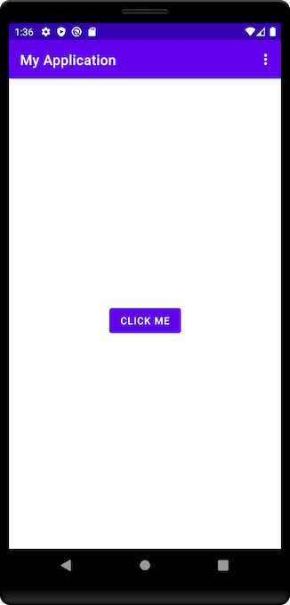
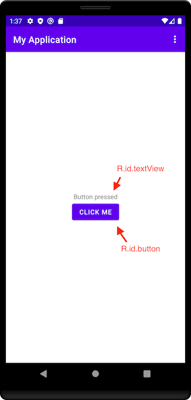
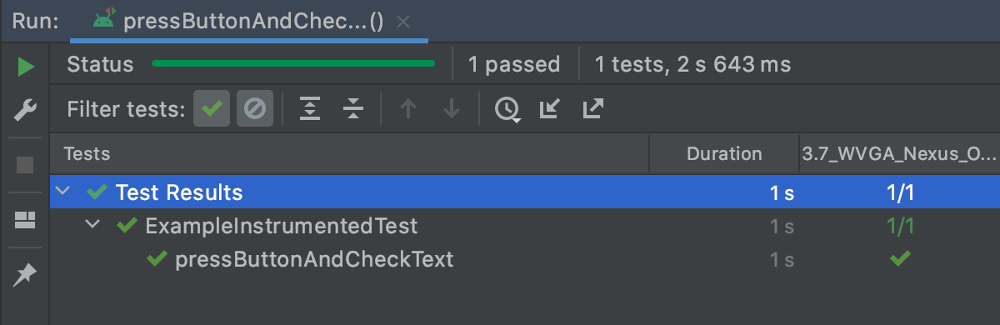

# UI testing

UI tests are a part of instrumentation tests. <br/>
That's why everything from [Instrumented tests topic](https://android-ui-testing.github.io/Cookbook/basics/instrumented_testing_basics/) is applicable to UI testing.

Ui testing goal is to check some scenarios of using your application.<br/>
Usually, we do ui testing for some common users scenario:

* Login to your application
* Process of ordering 
* Creating new chat 
* And so on

Simple Ui test can't catch the problem with wrong padding or wrong color of your view (only in cases where you specially check that) - because there is another type of tests used to catch such problems called `Screenshot testing` - you can read [Screenshot testing article](https://android-ui-testing.github.io/Cookbook/basics/screenshot_testing/) to get familiar with that.<br/>

So, if once we decided that we need to check users scenarios - we should definitely start writing Ui tests and let's start with tools, that will help us to write this type of tests.

## Main tool - Espresso and UiAutomator

Nowadays there is no doubt - for native UI testing on Android we should use Espresso for testing your application.
<br/>This is a main tool that allow us to make every test possible to access your codebase. That means tests with Espresso allow us to write white-box tests.
<br/>But you still able to write black-box tests or even gray-box with Espresso.

Why Espresso is so cool? It is synchronized with the main thread of your app and performs action only when main thread is in idle state.
<br/>It makes Espresso extremely reliable and stable (than any other existing tool) for Ui testing on Android.

Keep in mind that everything that isn't related to your app (for example, permission dialogs, volume +/- buttons, home button and etc) - can't be accessed directly within Espresso.
<br/>But don't worry - you can use `UiAutomator` for that purpose, and it can be called directly from test, written in Espresso.
<br/>`UiAutomator` is a slower tool and can support tests only in black-box style, but it can test everything outside your application on your phone.
<br/>Many cross-platforms tools for testing using `UiAutomator`.

These two tools are the main tools that everyone using for Ui testing on Android. <br/>
Remember, it's possible to create tests that will use both frameworks. For example, you can find your views and interact with them by `Espresso` and in the same test call `UiAutomator` to perform something specific, like pressing volume button. <br/>
But for usual testing you should prefer `Espresso` rather then `UiAutomator`. 

### Espresso

➕ Access to codebase <br/>
➕ Very fast and more stable than UiAutomator <br/>
➖ Can't perform OS actions <br/>
➖ Can't do anything outside your application <br/>

### UiAutomator

➕ Can do action outside your application <br/>
➖ Much fewer abilities to find the views and interact with them <br/>
➖ Slower and less stable than Espresso <br/>
➖ Nowadays it shouldn't be a problem but still, it's requires `minSdk >= Android 4.3 (API level 18)` <br/>

You can read more about both frameworks at official documentation. [Espresso](https://developer.android.com/training/testing/espresso) [UiAutomator](https://developer.android.com/training/testing/ui-automator) 

### Writing test on Espresso

Let's get familiar with Espresso.
<br/>Basically to start writing Ui tests we should:

* Find the `View` (using `ViewMatchers`)
* Interact with that `View` (using `ViewInteraction`)
* Check state of `View` (using `ViewAssertion`)

Let's start with the basic test.
<br/>We have activity with one button (and no text shown), once we press it - text "Button pressed" shown.

1. We should specify which activity we should run.
```kotlin
import androidx.test.ext.junit.rules.ActivityScenarioRule
import org.junit.Rule
...
    @get:Rule
    var activityRule: ActivityScenarioRule<MainActivity>
            = ActivityScenarioRule(MainActivity::class.java)
```
2. Create test and find our button (with `onView()` method and `withId` assertion by id)
```kotlin
    @Test
    fun pressButtonAndCheckText() {
        onView(withId(R.id.button))
    }
```

!!! Disclaimer

        Important addition - when you are trying to find some `View` that, for example, has same `id` like another View on that screen (that situation usually happens when you are trying to test screens with `RecyclerView`) you can add more `Matchers`
        Simply place all `Matchers` that apply to single `View` on your screen inside of `allOf()` method
        It will look like that
        
        <br/>@Test
        <br/>fun someTest() {
        <br/>&nbsp;&nbsp;&nbsp;onView(allOf(withId(R.id.button), withText("Click me")))
        <br/>}

3.Then we should perform click on it (with `click()` method from `ViewInteraction`)
```kotlin
    @Test
    fun pressButtonAndCheckText() {
        onView(withId(R.id.button))
            .perform(click())
    }
```
4. And finally, let's check that our text is shown (find the `TextView` and assert that it is displayed)
```kotlin
    @Test
    fun pressButtonAndCheckText() {
        ...
        onView(withId(R.id.textview))
            .check(matches(isDisplayed()))
    }
```
Once we run it (run it as usual test, but you should connect real phone or run emulator), we will see standard test result


**Final code of our test**
```kotlin
@RunWith(AndroidJUnit4::class)
class ExampleInstrumentedTest {

    @get:Rule
    var activityRule: ActivityScenarioRule<MainActivity>
            = ActivityScenarioRule(MainActivity::class.java)

    @Test
    fun pressButtonAndCheckText() {
        onView(withId(R.id.button))
            .perform(click())

        onView(withId(R.id.textview))
            .check(matches(isDisplayed()))
    }
}
```

### What else?

Espresso is quite powerful tool with a lot of abstractions inside it. 
<br/>But there is a quite famous "cheat-sheet" for Espresso, I hope it will be helpful for everybody.


From that cheat-sheet you can understand which methods you can use for finding the `Views`, which methods for interactions with Views and which methods for checking the data.

### Something like conclusion

To be honest, there is a lot of edge-cases once you are trying to write your own tests. That's one of the reasons why that CookBook was created, so we are suggesting to read next articles to understand how to overcome many of common problems that you will face in Ui testing. <br/>
Beside that fact, that `Espresso` and `UiAutomator` are the main tools to do Ui testing on Android, you may notice at [Companies experience article](https://android-ui-testing.github.io/Cookbook/adoption/companies_experience/) that almost nobody uses only these tools.<br/>

That happens because there a lot of solutions nowadays created over `Espresso` and `UiAutomator` (that means that they use these frameworks under the hood), that makes your test even more stable and readable.<br/>
For example, you can see at [Page object article](https://android-ui-testing.github.io/Cookbook/practices/page_object/) how people overcome problem of readability of your tests and usually prefer something like [Kakao library](https://github.com/agoda-com/Kakao). <br/>
Or take a look at [Flakiness article](https://android-ui-testing.github.io/Cookbook/practices/flakiness/) where you can find information why even in `Espresso` our tests might be failed even if everything looks ok and test can pass from second attempt. That article will tell you which tools helps us to minimize that risks.