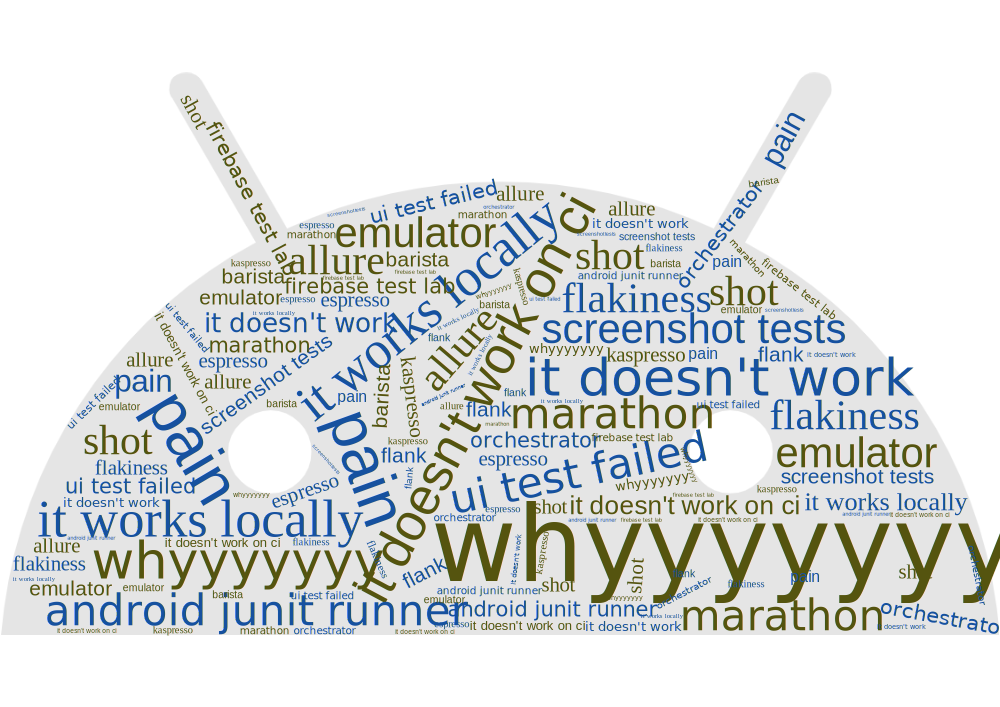

# Home

Despite the annual improvement of tools — everything related to Android instrumented testing still can be challenging and requires a lot of attention from engineers.

The goal of this blog is to make the process of introducing instrumented testing into your team smoother and avoid repeating our mistakes.

**You know nothing about UI & Screenshot Testing and doing your first steps?**
 Chapter [Basics](https://android-ui-testing.github.io/Cookbook/basics/testing_theory/) will help you

**You are in a process of adoption of UI & Screenshot Testing?**
 Chapter [Practices](https://android-ui-testing.github.io/Cookbook/practices/state_clearing/) will answer on the most of questions you probably have

**Want to adopt UI & Screenshot testing, but don't know where to start from?**
 Chapter [Adoption](https://android-ui-testing.github.io/Cookbook/adoption/companies_experience/) will be helpful

**Want to say thank you?**
 Star [this repository on the Github](https://github.com/android-ui-testing/Cookbook/)

