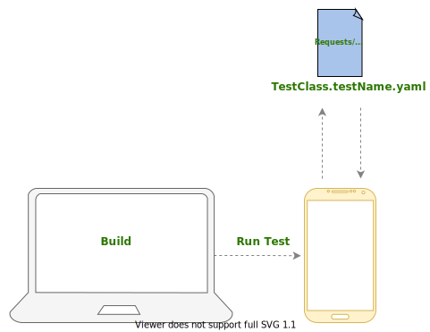

# Network

UI testing can play a role of regular auto-testing in your project. Your app communicates with external services to retrieve data e.g. user profile after login. This communication happens asynchronously, what hinders Ui Testing as explained below. In that case, you have to choose, how to deal with network connections.

### Problems

Ideally, we want to achieve the next picture:

<Picture1 TBD>

As we can see, all levels of the application are covered, the test is fully integrated, therefore, more reliable, with
a product quality point of view. If the backend changed the contract, we will know about it right away.

Unfortunately, this has a downside: everything about the network is unstable. The internet suddenly works a lot of worse or stop working altogether, or your backend may have redeployment step.
If you make `GET` and `UPDATE` operations on the same data, the next time the test runs, the `GET` operation will run with the updated value, what might make the test fail, since when it was written it was expecting to `GET` the non-updated data.

All of this can cause your test to fail and show a non-representative false result. On the other side,
if you completely abandon the network, you cannot name it E2E test. Like everything in UI tests, networking is a trade-off.

Unfortunately, here it will not be possible to find a 10your0% correct solution that will be simultaneously stable and test every layer in your app at the same time.

Let's look, which options do we have

### Real network

* **Production server**
   _You will get 100% `E2E`. On the other hand, not all applications will be able to do this (for example, in the banking community)_

* **Development server**
   _We still have `E2E`, but the environment can be significantly different from production. Also, regular redeployment
  can be a problem_
* **Special stage server**
   _Can be different with your production/development backend. Also pay your, that it requires an
  additional effort from engineers to support it. It also is not E2e, as it tests not a real backend side._
  
???+ warning
    It doesn't matter which of the options above you choose: Internet connection always can be an issue, because you cannot guarantee stability at any time.
     If you use UI testing as a part of pull request or release pipeline, it's better to avoid real network usage there, but just run them regularly several times a day 

### Mock network (manually)

* **[MockWebServer](https://github.com/square/okhttp/tree/master/mockwebserver)**
   _Part of `OkHttp` library. Allows intercepting and responding of each http request._
   You can find more details about it [here](https://adambennett.dev/2021/09/mockwebserver-https/)
  
* **Custom Interceptor**
   _In the simplest implementation, this is a common interceptor which is intercepts each http call, which is added only in tests and actually replaces
  triggered requests for predefined responses. 
    However, unlike `OkHttpWebServer`, it works for more
  high level, therefore, may miss some bugs. 
   Also, in the most of the cases, we don't need to test third party libraries code_
* **DI**
    _Each DI framework ([Dagger2](https://github.com/google/dagger) / [Toothpick](https://github.com/stephanenicolas/toothpick) / [Koin](https://github.com/InsertKoinIO/koin) / etc) allows you to replace dependencies in tests.
    We can replace the `Retroift Service` or the whole` Repository` entirely. However, we actually crop
  testing the entire network layer and offline mode if it exists_

**Problems**

You need to mock manually. Imagine, that in your flow has hundreds of http requests.
  You may spend a lot of time mocking every single http response, and it's really challenging to keep these tests up-to-date.

### Mock network (automatically)

The key idea is that two modes of network operation appear in the tests:`Record & Replay`.

* **Record**
   _In this mode, the test uses a real backend. However, it also records all requests and exports them to set or to one file that can be associated with a specific test. 
   This mode is used locally only when writing a test_
  

* **Replay**
   _Instead of a real network, an already recorded file is used. This mode is used both locally and on CI. It allows to fully exclude all the possible problems with a network.
  Also, we've got an opportunity to easily mock authorisation and skip some on-boarding screens in this mode, because we have a full picture in terms of http requests._
  

 

**Instruments:**

* **[Wiremock](https://github.com/wiremock/wiremock)**   
     ➕ Works on the system level (`MITM` internally)
      ➕ `Record/Replay` from the box
      ➕ Keeping request time in `playback` mode 
      ➕ Request indexing _(the same request can be recorded with different answers, if it executes multiple times)_ 
      ➕ Smart request substitution _(Will substitute similar request if particular one hasn't been found)_
      ➕ Manually mocking support
       ➖ Not Android friendly
      ➖ Doesn't support multiple hosts from the box
      ➖ Doesn't convenient output (set of json files)
      ➖ Requires a custom implementation of storing files
      You may find an example [how to implement it here](https://handstandsam.com/2016/01/30/running-wiremock-on-android/)
     
  
  
* **[OkReplay](https://github.com/airbnb/okreplay)**
   ➕ Android Friendly, easy adoption
   ➕ OkHttp interceptor internally
   ➕ Multiple hosts from the box (because of interceptor)
   ➕ Readable and editable output _([.yaml file](https://github.com/airbnb/okreplay/blob/master/okreplay-tests/src/test/resources/okreplay/tapes/smoke_spec.yaml) with all recorded requests and responses in a one place)_
   ➕ Opportunity to pull stubs from the device and store them to the device
    ➖ Doesn't maintain
   ➖ Doesn't have request indexing
   ➖ Doesn't keep http request time
   ➖ Doesn't have manually mocking
   ➖ Doesn't have smart indexing
  
  
* **Solution from Revolut (Work in progress)**
   _Revolut prepares an open source library, which allows getting rid of all problems mentioned above and make adoption a way easier_

**Problems** 

* Account preparation
   _You need to prepare a user which matches the special condition you need to test. It can be still mocked manually or via specially created service, which does this job for you_
   
* Core changes
   _As soon as your root code base changed in terms of http requests, you probably would need to re-record some tests. That's why it's better to skip authorisation mode in the `playback` mode, to reduce such cases_
  

### Conclusion

No perfect solution exists, it all depends on a number of factors, for example, the size of the team and how often the code base changes.
It also depends on what goals you set in UI testing.

??? question "Should I avoid real network testing in general?"
    Depends on UI testing goals, project type and testing priorities.
        If it's important for you to have UI testing as a part of `Pull Request` or `Release` pipelines, then it's very important to put the stability of these tests first
    a place.
     Mocking the network, you sacrifice some uncaught bugs, but you get stability and speed in return. These 
    tests will not catch a bug when something has changed on the backend, but you can test how your product is ready for a change
    contract and nullable/non-nullable fields.
      On the other hand, if you do not need a full automation and having UI testing as a part of it, and at the same time an option to use production backend, tests with a real network are all still have the right to life in your product.

??? question "I have a small project. Which tool can I use for mock?"
    If you have not a lot of http requests, like 5-20 on application
    start, [MockWebServer](https://github.com/square/okhttp/tree/master/mockwebserver) will be pragmatic option

??? question "I have a lot of http requests, my codebase changes really often"
    Record/Replay practice will be useful in that case. Check [OkReplay](https://github.com/airbnb/okreplay)
    or [Wiremock](https://github.com/wiremock/wiremock)
    solution.
      Also, you can combine approaches: Record & Replay, and mock only specific requests.

You also may
check, [what approaches are used by other companies](https://android-ui-testing.github.io/Cookbook/adoption/companies_experience/)