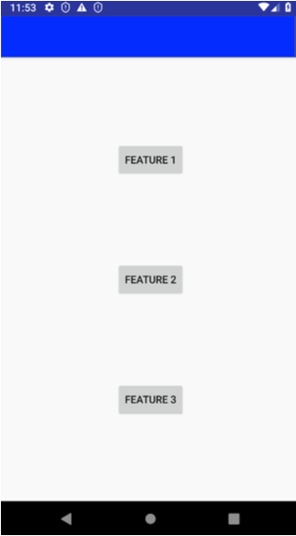

# Page object

How to make tests more clear and readable?

## Problem
UI test aim to verify the state of the screen state after interacting with its views.
For those interactions to happen, we need to find `ViewMatchers` that are unique to the views we'll interact with.
<br/>
Imagine that we do have hundreds of tests whose first interaction is pressing the very same button. We define its id to be the `ViewMatcher`.
What if that button would change its id? We'd need to adapt the `ViewMatcher` of that button inside every single test.
<br/>
Moreover, what if our `View` requires numerous `ViewMatchers` to be uniquely identified (for example when that `View`
is a child of `RecyclerView`, where all recyclable vies have the same id)
<br/>

What should we do in such cases? Should we put this `View` into another abstraction level?

## Solution: Page Object Pattern

That pattern came to the Android world from Web testing indeed. This is how `PageObject` defined by one of its creators:
> The basic rule of thumb for a page object is that it should allow a software client to do anything and see anything that a human can. It should also provide an interface that's easy to program to and hides the underlying widgetry in the window. So to access a text field you should have accessor methods that take and return a string, check boxes should use booleans, and buttons should be represented by action oriented method names.
> <br/> www.martinfowler.com/bliki/PageObject.html

### Example

We do have some screen with 3 `Buttons`



#### Let's write some test for that screen with plain Espresso

```kotlin
@Test
fun testFirstFeature() {
    onView(withId(R.id.toFirstFeature))
        .check(ViewAssertions.matches(
                ViewMatchers.withEffectiveVisibility(
                ViewMatchers.Visibility.VISIBLE)))
    onView(withId(R.id.toFirstFeature)).perform(click())
}
```

That test finds one of our buttons, checks its visibility and after that performs a click.

The main problem here — it's not easy to read.

#### What do we want to achieve with PageObject?

Ideally we want to have something like

```kotlin
@Test
fun testFirstFeature() {
    MainScreen.firstFeatureButton.isVisible()
    MainScreen.firstFeatureButton.click()
}
```

What is the difference?

* We do not use `ViewMatcher`s inside our test: they are hidden under our `PageObject` <br/>
* We added `MainScreen` abstraction. It is the `PageObject` of the screen provided in the example <br/>
* `isVisible()` and `click()` are implemented as Kotlin extensions (for example)

As you can see, that change made our code more clear and readable. And that happened even with one single test that
checks the visibility of a button and clicks on it.

Just imagine how much effort that pattern will bring to your codebase in case of hundreds of tests written
with the `PageObject`

### Instead of writing your own implementation of PageObject pattern

Just take a look at the [Kakao library](https://github.com/agoda-com/Kakao). It has a modern `Kotlin DSL` implementation
of the `PageObject` pattern.

It comes with a lot of useful classes and actions for View interactions. That's why other libraries like `Kaspresso` use `Kakao` under the hood. <br/>
For example, the same test for our screen written with `Kakao` would look like this

```kotlin
@Test
fun testFirstFeature() {
    mainScreen {
        toFirstFeatureButton {
            isVisible()
            click()
        }
    }
}
```

## Conclusion

`PageObject` pattern helps us to:

➕ Make the code more readable and clear<br/>
   1. `ViewMatchers` make the code hard to read, and  all of them are now inside of the `PageObject` class.
   2. no more `ViewMatchers` duplication among tests: all Views have their `ViewMatchers` uniquely defined in the `PageObject` class.<br/>
➕ Once we change the id/text/whatever of the target `View` we should change it only in one place: the `PageObject` class <br/>
