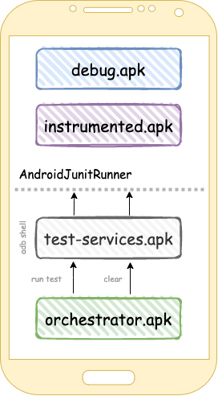
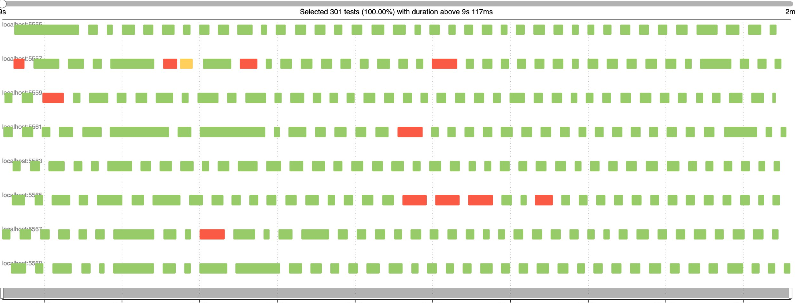

# State clearing
Whenever we execute UI tests, it is likely that we read/write some data locally. 
These changes can affect the execution of the subsequent tests, for example:

* We run `Test1`, it performs some http requests, saves some data to files and databases.
* When `Test1` is finished, `Test2` will be launched.
* However, `Test1` left some data on the device which can be a reason of `Test2` failing.

That's where *state clearing* comes to the rescue: clear the data before each test

## Strategies for state clearing

There are a few strategies to deal with this:

1. Clearing within a process
2. Clearing package data

### 1. Clearing within a process

The state clearing happens *without killing the application process*. We have 2 options here:

##### Use component from a real code base <br/>

``` kotlin
@Before 
fun setUp() {
   DI.provideLogoutCleanerInteractor().clear() 
}
```

The same component which clears data _(For instance, while logout)_. It should honestly clear everything in your
application:
Databases, Files, Preferences and Runtime cache, and should be executed before each test.
!!! danger

    This solution is a bottleneck and it's better to avoid it at all. If LogoutCleaner is broken, all of the tests will be failed. 

<br/>

##### Clear internal storage  <br/>

All cache data (e.g.local databases, shared preferences and some files) in any android application is written in the internal storage: `/data/data/packagename/`
<br/>This storage is our application sandbox and can be accessed without any permission.

In order to avoid any issues, the basic idea is to avoid using components from a real code base. Instead of them, use some tests rules which do the job
for us.

```kotlin

@get:Rule 
val clearPreferenceRule = ClearDatabaseRule()

@get:Rule 
val clearFilesRule = ClearFilesRule()

@get:Rule 
val clearFilesRule = ClearPreferencesRule()

```

They have already been implemented in [Barista](https://github.com/AdevintaSpain/Barista/) library, you can find
them [here](https://github.com/AdevintaSpain/Barista/tree/master/library/src/main/java/com/adevinta/android/barista/rule/cleardata)

!!! warning

    This solution won't work in 100% of cases:

    1. You may have runtime cache, which can also affect your tests
    2. The test or the application process may crash and prevent the launch of next tests

##### Conclusion<br/>

These are pros/cons for both solutions which don't kill the process:

➕ Easy implementation. Simply add the corresponding TestRules<br/> 
➕ Fast execution in the same process<br/>
<br/>
➖ Don't give you any guarantee that your app will be cleared properly<br/>
➖ Application or Test process killing will break tests execution <br/>
➖ Can be a bottleneck<br/> 

Use these solutions only as a temp workaround, because it won't work in long-term for huge projects

### 2. Clearing package data

Our aim is to simulate the same behavior as when the user presses the `clear data` button in application settings.
<br/>Application process will be cleared in that case, our application will be initialized in a cold start.

##### Orchestrator

The Android Orchestrator aims to isolate the state of each test by running each of them in a separate process:
That can be achieved by executing your tests like this

```bash
adb shell am instrument -c TestClass#method1 -w com.package.name/junitRunnerClass
adb pm clear
adb shell am instrument -c TestClass#method2 -w com.package.name/junitRunnerClass
adb pm clear
```

That's the idea behind of `Orchestrator`.
<br/>
It's an `apk` which only consists of [several classes](https://github.com/android/android-test/tree/master/runner/android_test_orchestrator/java/androidx/test/orchestrator)
that run tests and clear data, as described above.

It is necessary to install an `orchestrator` along with the `application.apk` and the `instrumented.apk` on the device.

But that's not all.
<br/>
The Orchestrator also needs to execute adb commands. For that it uses [special services.](https://github.com/android/android-test/tree/master/services) under the hood.
It's just a shell client and should be installed on the device.



[An official documentation and guide how to start with Orchestrator](https://developer.android.com/training/testing/junit-runner#using-android-test-orchestrator)

!!! warning

    Despite the fact that it does the job, this solution looks overcomplicated:

    1. We need to install +2 different apk to each emulator
    2. We delegate this job to the device instead of the host machine. 
    <br/>Devices are less reliable than host pc

##### Other solutions

It's also possible to clear package data by
using [3rd party test runners](https://android-ui-testing.github.io/Cookbook/practices/test_runners_review/), like
Marathon, Avito-Runner or Flank. Marathon and Avito-Runner clear package data without an orchestrator. They delegate
this logic to a host machine.

##### Conclusion<br/>

These are pros/cons for an `orchestrator` and 3rd party test runners solution:

➕ Does 100% of the job for us<br/>
➕ Avoid test failing in cascade due to the application process being killed<br/>
<br/>
➖ Slow execution <br/> 
➖ Requires to install extra components — over-complicated: <br/>

The slow execution has 2 sources:
1. The time consumed in killing and restarting the process where each test runs, multiplied by the amount of tests.
2. Executing `adb pm clear` after each test takes some time and depends on apk size. Below you may see some gaps between the tests which represent such a delay.




## Final conclusion
!!! success

    Only package clearing can guarantee that the data will be cleared properly between test executions.
    Marathon and Avito-Runner provide the easiest way to clear application data.

    1. One simply needs to set a flag in their configuration
    2. They don't use orchestrator under the hood, avoiding its caveats


    
    
